# Tema 8. Desplegando aplicaciones en la nube: Uso de PaaS y DBaaS


## Ejercicio 1

`Darse de alta en algún servicio PaaS tal como Heroku o BlueMix o usar alguno de los PaaS de otros servicios cloud en los que ya se esté dado de alta`

Creamos una cuenta en IBM Cloud


Aceptamos los términos de condiciones del servicio y las cláusulas de privacidad de la cuenta de IBM Cloud


IBM cloud nos da la bienvenida y nos muestra un dashboard en el que podemos observar el estado inicial de la cuenta y las acciones posibles. Vamos a tratar de crear un recurso BlueMix, o como lo llaman ahora, CloudFoundry.


Seleccionamos la opción de crear un nuevo recursos. Dentro nos da la opción de elegir el entorno de ejecución que vamos a usar.


Como tengo claro que voy a usar mi aplicación de gestión de tienda musical escrita en nodejs, eligo el entorno de nodejs.


A continuación elegimos el dominio para exponer nuestro desarrollo, nos da a elegir un dominio dentro de la antigua marca (bluemix), pero nosotros vamos a seguir usando la actual, la de cloudfoundry.


Creamos el recurso finalmente 


Esperamos a que complete la creación y el despliegue del recurso.


Una vez finalizada la creación del recurso vamos a tratar de acceder a la aplicación de prueba que nos integra IBM Cloud Foundry por defecto.


Finalmente podemos acceder a la aplicación de demo de forma satisfactoria.


## Ejercicio 2

`Crear una aplicación en Heroku o en algún otro PaaS en el que se haya dado uno de alta. Realizar un despliegue de prueba usando alguno de los eejmplos incluidos con el PaaS`

La aplicación de demo que se ha dado ha sido desplegada en el ejercicio 1, por favor, lee el ejercicio 1 antes, que lo detallo paso por paso.


## Ejercicio 3

`Instalar y echar a andar tu primera aplicación en Heroku`


Primero tenemos que instalar las herramienta de línea de órdenes de IBM:

`curl -fsSL https://clis.cloud.ibm.com/install/osx | sh`

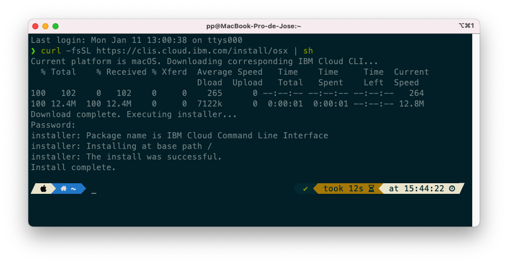

Una vez instalado necesitamos iniciar sesión con la cuenta de IBM cloud

```bash
ibmcloud login
```

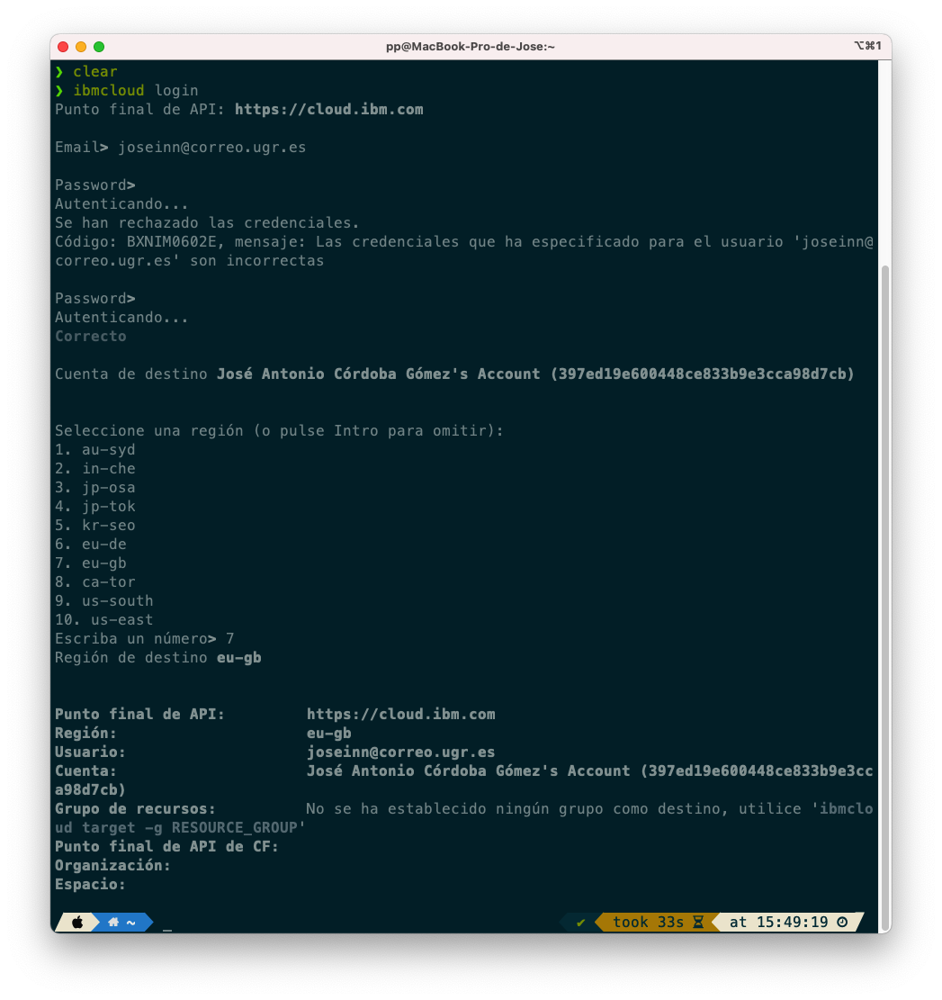

Y vinculamos el cloudfoundry target por defecto:

```
ibmcloud target --cf
```

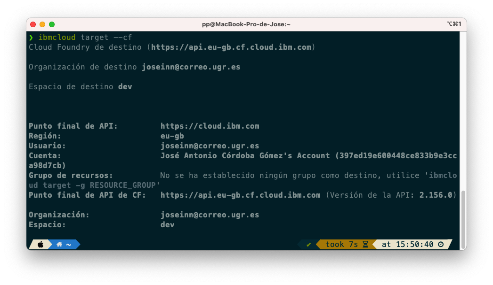

Clonamos nuestro repositorio


Y creamos un fichero `manifest.yml`

```yaml

applications:
- name: MusicStore
  memory: 64M
  commad: npm install && npm start
```

Podemos ver la lista de recursos cloudfoundry creados con anterioridad con

```bash
ibmcloud cf apps
```

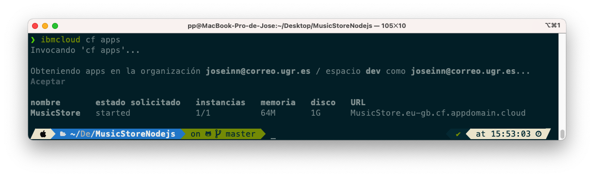

Estamos listo para desplegar la aplicación con: 

```bash
ibmcloud cf push
```

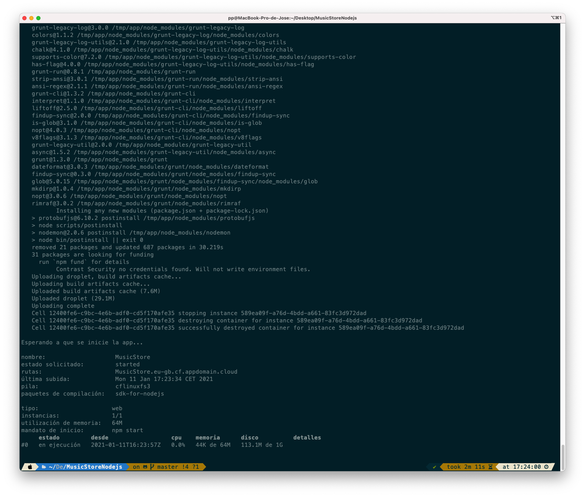

Nos metemos en la ruta anterior para verificar que funciona correctamente

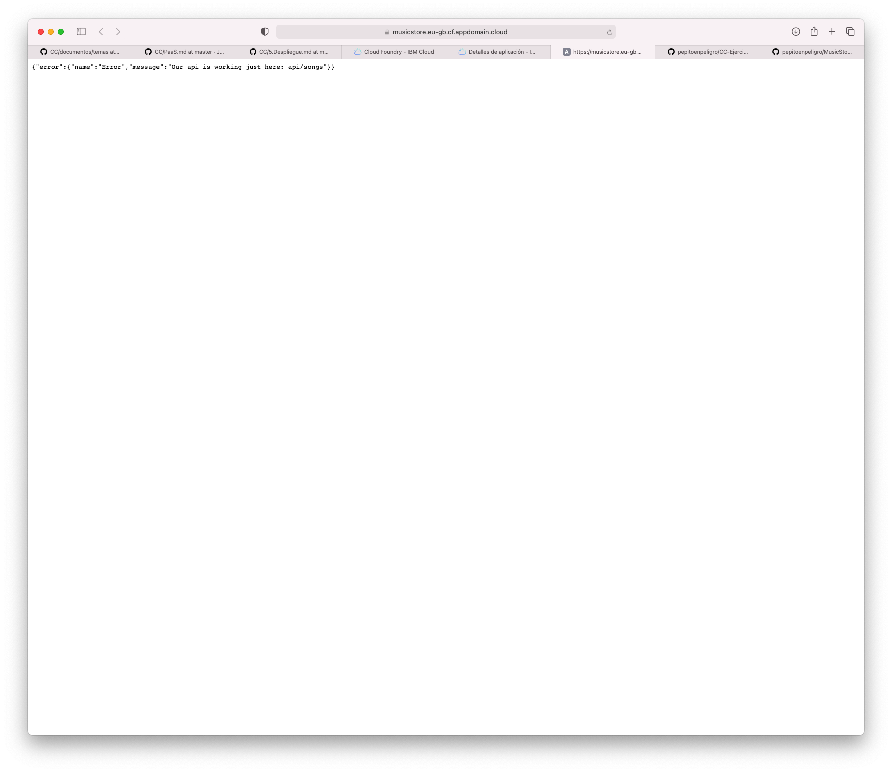


## Ejercicio 4

`Usar como base la aplicación de ejemplo de heroku y combinarla con la apicación en node que se ha creado anteriormente. Probarla de forma local con foreman. Al final de cada modificación, los test tendrán que funcionar correctamente; cuando se pasen los tes, se puede volver a desplegar en heroku`

Instalamos foreman:


```bash
brew install cask foreman
```


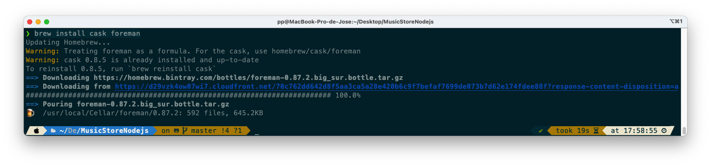

O con npm de forma global:


```bash
npm install -g foreman
```


Foreman nos proporciona diferentes comandos como `check, run y start`

Definimos nuestro `Procfile` como:

```yaml
web: node index.js
worker: node index.js
dev: node-supervisor index.js
profile: node --prof  index.js
```

y Ejecutamos los comandos anteriormente descritos:


```bash
foreman version
foreman check
foreman start
```


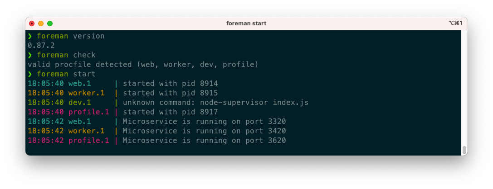


## Ejercicio 5

`Haz alguna modificación a tu aplicación en node.js para Heroku, sin olvidar añadir los test para la nueva funcionalidad, y configura el despliegue automático a Heroku usando algún servicio de los mencionados en StackOverflow`


Para empezar, vamos a diseñar una funcionalidad nueva que consiste en borrar todo el contenido del array de canciones, que corresponderá con el verbo `delete`de http.

Antes de implementar la funcionalidad, dejamos un `snapshot` del proyecto:


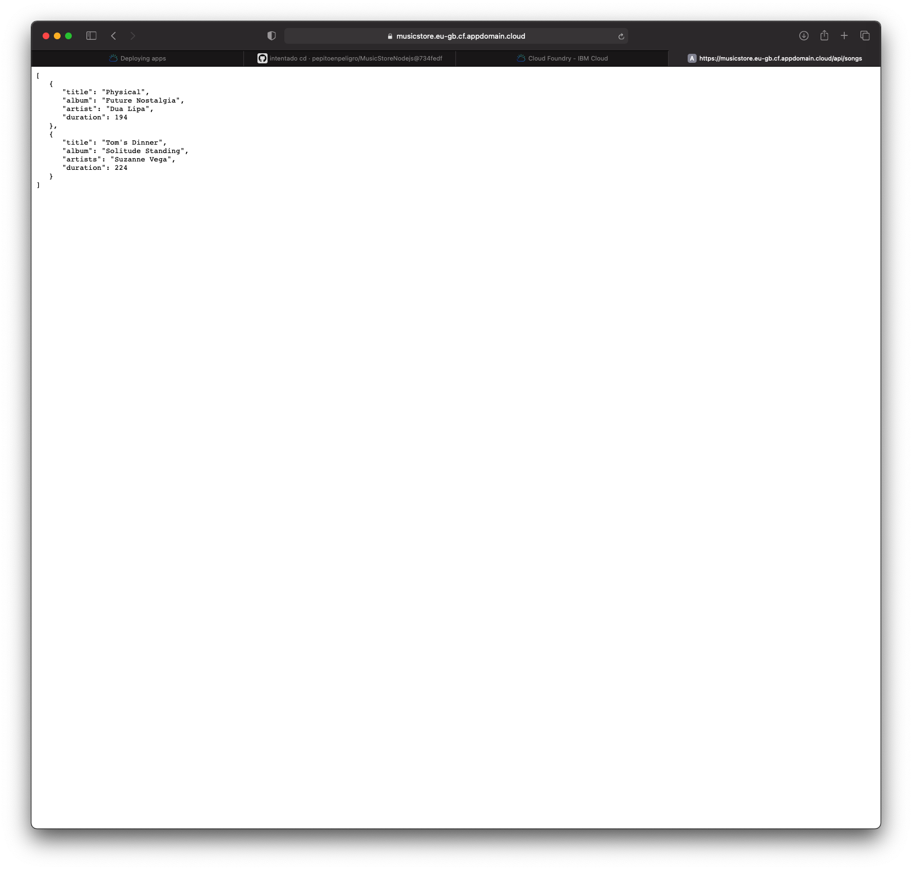


Y que intentamos hacer la peticion de DELETE, no te deja:

```bash
curl --location --request DELETE 'https://musicstore.eu-gb.cf.appdomain.cloud/api/songs'
```


Añadimos la funcionalidad en el controlador de rutas:

```javascript
exports.deleteSongs = (request, response) => {
    songs = [];
    response.status(200);
    response.send({
        message: 'Songs Delete ok'
    })
}
```
Y agregamos la ruta:

```javascript
router.delete('/song', deleteSongs);
```

Definimos el test apropiado:

```javascript
describe('DELETE', () => {
        it('It should erase all songs from db', (done) => {

            request
                .delete(routeSong)
                .expect(200, done);
        })
    })
```

Y comprobamos que pasan los test con Mocha:


```javascript
mocha test
```

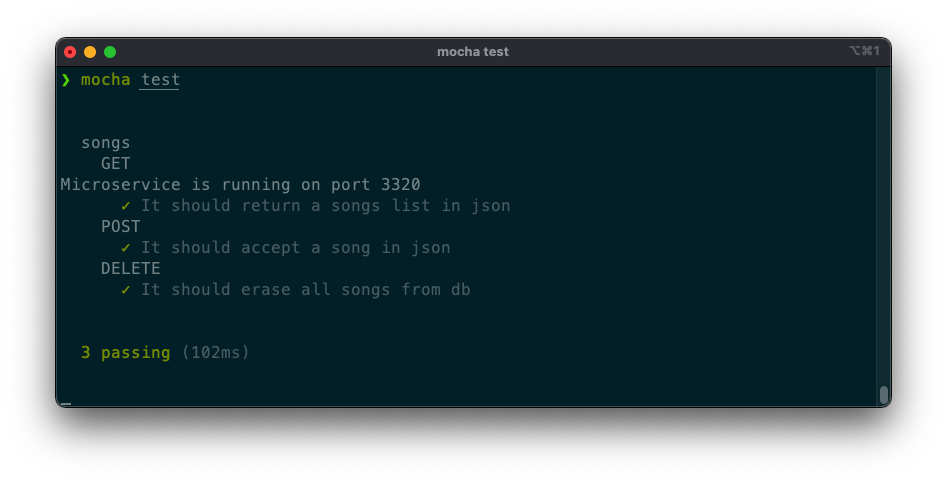

La prueba de que pasan los test, deberíamos de hacerlo en un sistema de CI. Como eso lo hemos hecho mil veces de forma transversal en la asignatura, vamos a centrarnos en lo que no hemos hecho hasta el momento, que es automatizar el despligue.

Para ello, he creado una github action que automatiza el despligue sobre cloudfoundry de IBM cloud.


```yaml
name: Deploy to IBM Cloud Foundry
on:
  push:
    branches: [ master ]
jobs:
  deploy:
    runs-on: ubuntu-latest
    steps:
      - name: Download my repo
        uses: actions/checkout@v2
      - name: Display repo files
        run: |
          echo "This is all worflows can see:"
          ls -la 
      - name: Installing ibmcloud CLI
        run: | 
          curl -fsSL https://clis.cloud.ibm.com/install/linux | sh
      - name: Instalo el cliente cloudfoundry de IBM
        run: | 
          ibmcloud cf install
      - name: Do Login in IBMcloud account
        run: |
          ibmcloud login --apikey  ${{ secrets.IBM_CLOUD_API_KEY }} -r eu-gb 
        # Se puede obtener el target con ibmcloud resource groups
      - name: Specificating target where I deploy this repo
        run: |
          echo "You can see organizer email in ibmcloud portal > Manage > IAM Access > Users > CloudFoundry"
          echo "Normally email is your email and space is dev or watever you have in your manifest.yml"
          ibmcloud target -o ${{ secrets.IBM_CLOUD_FOUNDRY_ORGANIZER_EMAIL }} -s ${{ secrets.IBM_CLOUD_FOUNDRY_PROJECT_ESPACE }}
      - name: Despliego en Cloud Foundry
        run: |
          ibmcloud cf push -f $(find . -name "manifest.yml" | head -1)
```

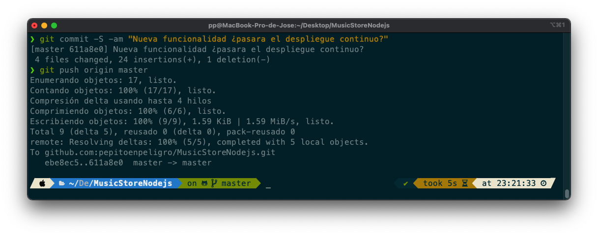

Esperamos a que termine de desplegar...
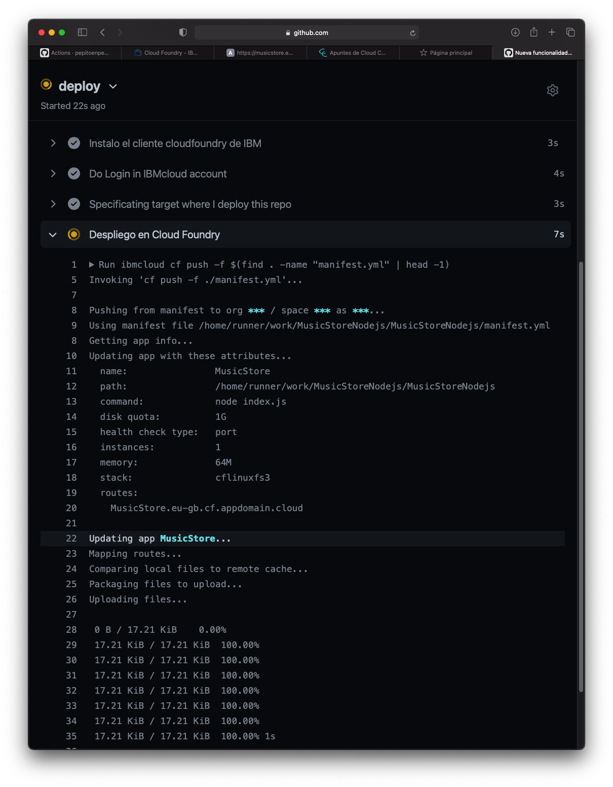


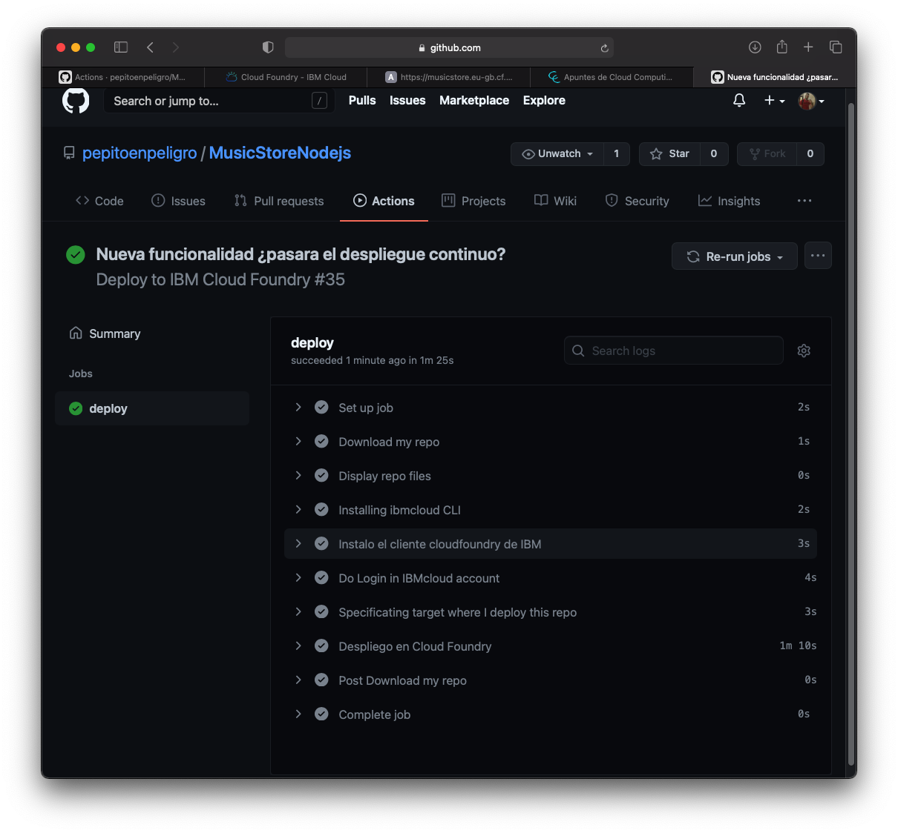

Realizamos las peticiones con postman (por comodidad) y probamos que surgen efecto.

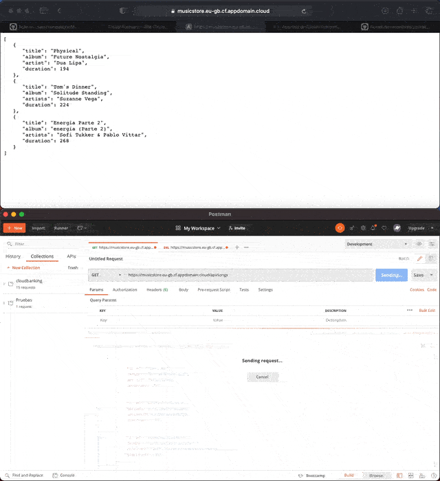


## Ejercicio 6

`Crear una aplicación mínima y usar un buildpack no estándar para desplegarla en Heroku. Esto será imprescindible si se usan lenguajes como Rust, por ejemplo`


Leyendo en la documentación oficial de IBM Cloud (Cloud Foundry Enterprise Environment](https://cloud.ibm.com/docs/cloud-foundry?topic=cloud-foundry-using_buildpacks), podemos usar buildspacks externos, a parte de los que ya nos proponer `ibmcloud cf` por defecto.

Los buildpacks que proponen a fecha de escritura de este ejercicio son:


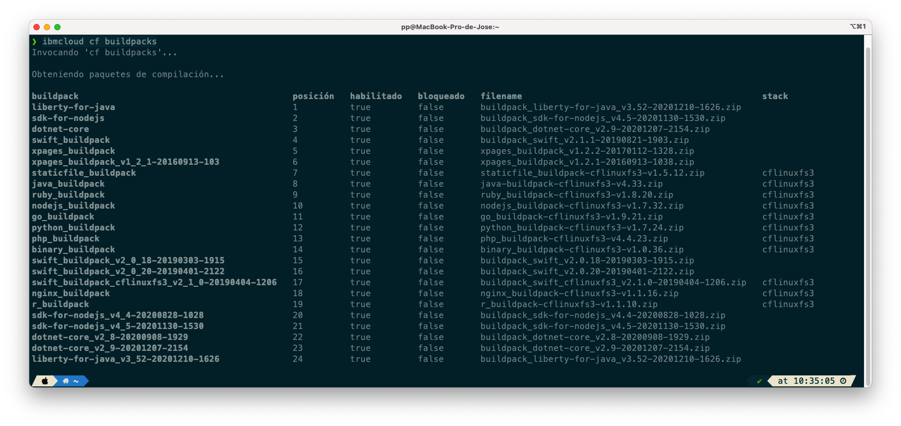


Por tanto, nuestra tarea, es poder encontrar un buildpack concreto para Rust (nuestro lenguaje de proyecto).

Las búsquedas son bastante pobres, pero conseguimos encontrar el siguiente buildpack: [No9 Rust Buildpack](https://github.com/No9/rust-buildpack.git)

Vamos a intentar descifrar un poco qué contiene este buildpack. Si vamos a su `manifest.yml` podemos encontrar lo siguiente:

```yaml

---
language: rust
url_to_dependency_map:
  - match: rust-(\d+\.\d+\.\d+)
    name: rust
    version: $1

dependencies:
  - name: rust
    version: 1.10.0
    uri: file:///Users/pivotal/workspace/rust-output/rust-1.10.0.tgz
    md5: 1460714f450f3f1d2ff2032acdcbb436
    cf_stacks:
      - cflinuxfs2

exclude_files:
- ".git/"
- ".gitignore"
- ".gitmodules"
- cf_spec/
- target/
- "*.zip"
```

Por lo que trata de usar la version 1.10 de Rust.


La propia documentacion nos da un ejemplo de qué tenemos que indicar de forma mínima en el `manifest.yml` para el lanzamiento de nuestra aplicación:


```yaml
---
applications:
- name: rust-app
  instances: 1
```


*Hemos creado una modificación del buildpack porque el que viene definido tiene un error de la herramienta cargo al no haberse actaulizado desde hace 3 años*

Por lo que lanzamos el despligue con:


```bash
ibmcloud cf push -f ./manifest.yml -b https://github.com/pepitoenpeligro/rust-buildpack.git
```


Podemos ver los logs del proceso con

```bash
ibmcloud cf logs rust-app --recent
```


Hemos tratado de realizar diferentes cambios y no ha habido forma de conseguir que enlace el binario, por lo que hemos decidido trasladar el despligue a heroku con su correspondiente build-pack.

Hemos definido nuestro *Profile* tal y como sigue:

```yaml
web: ./target/release/music_store
```

y hemos comprobado que es correcto con `foreman check`:

```bash
❯ foreman check
valid procfile detected (web)
```
Creamos el proyecto de heroku iniciando sesión y ejecutando la siguiente secuencia:

```bash
heroku login
heroku create --buildpack emk/rust
```


Por tanto, solo nos queda commitear el cambio y hacer un push a heroku con:


```
git push heroku master
```

Esperamos a que el despliegue se realice y comprobamos que el servicio es correcto haciendo (varias) peticiones desde *Postman*

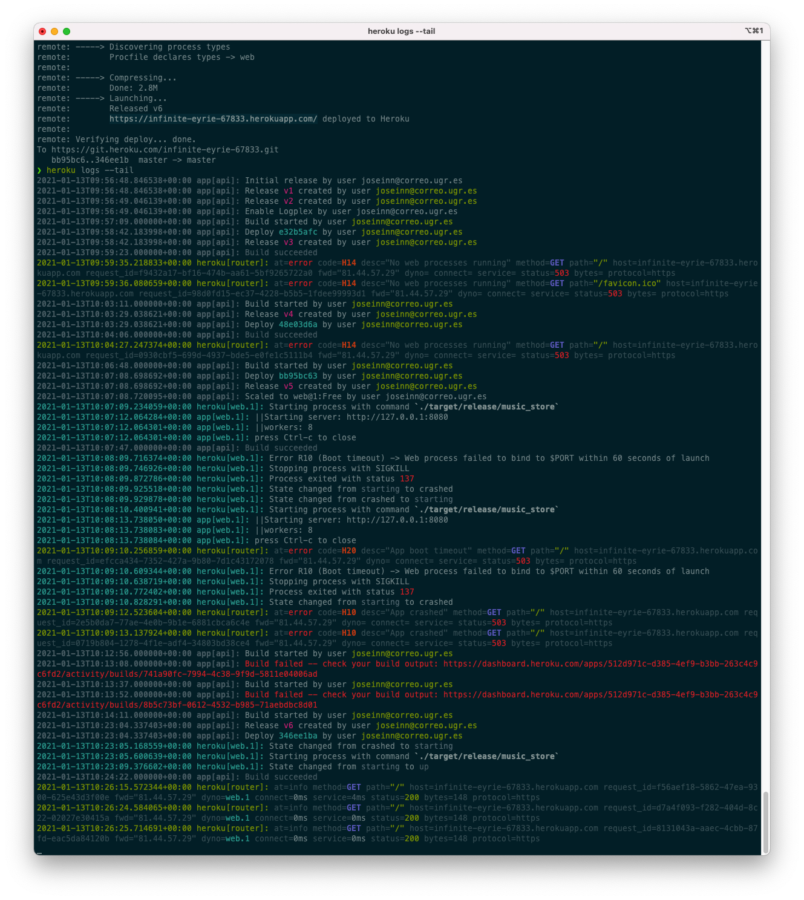

Si vemos los logs de la parte inferior podemos ver que se reciven correctamente las peticiones *GET* sobre la ruta raíz del servicio. También se puede encontrar la dirección en la que se ha expuesto el servicio. Lo voy a dejar un tiempo para que quien quiera pueda testar su funcionamiento.


## Ejercicio 7

1. `Darse de alta en un servicio Redis en la nube y realizar sobre él las operaciones básicas desde el panel de control`
2. `Instalar un cliente de línea de órdenes de Redis o una biblioteca cliente REST y realizar desde él las operaciones básicas de creación y lectura de información`
3. `Ejecutar ejemplos de cualquier lenguaje de programación sobre la instalación realizada`


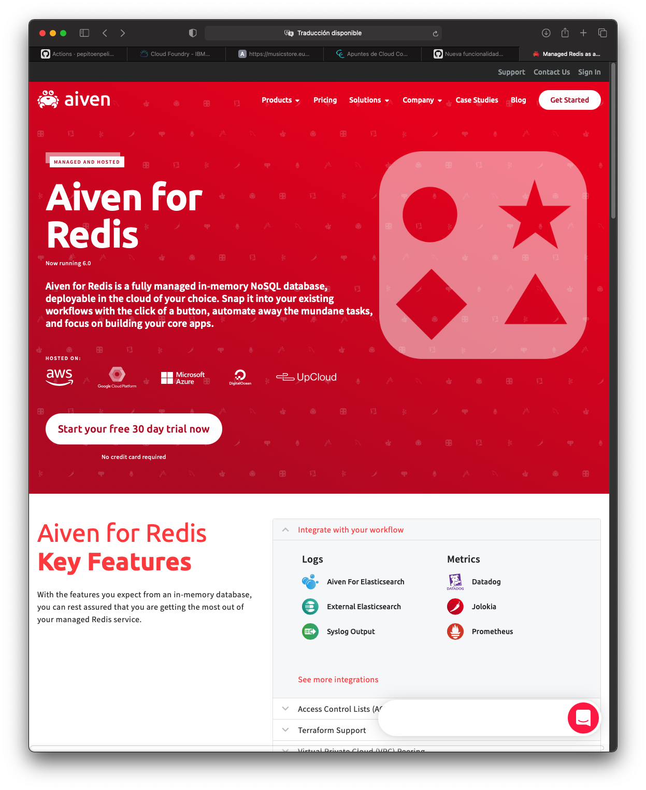

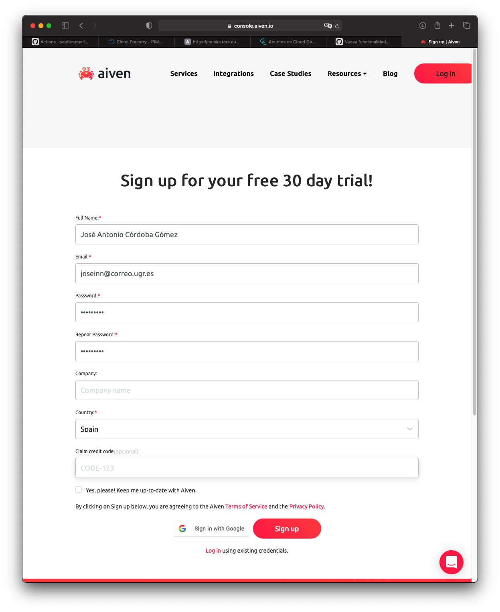

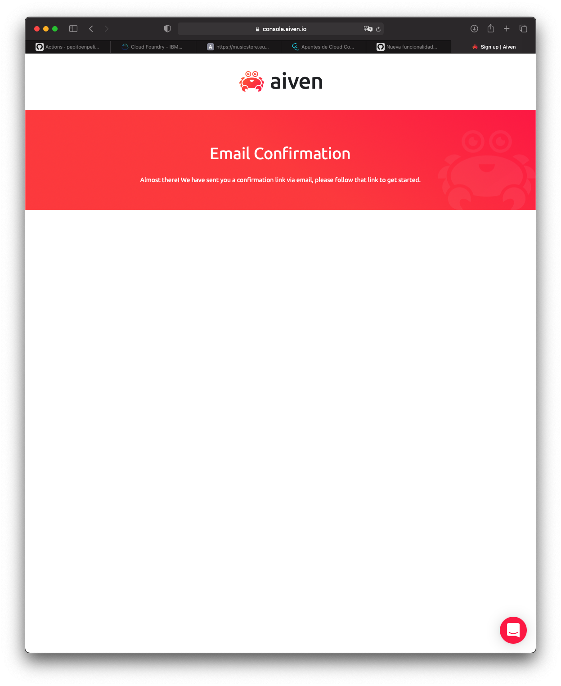

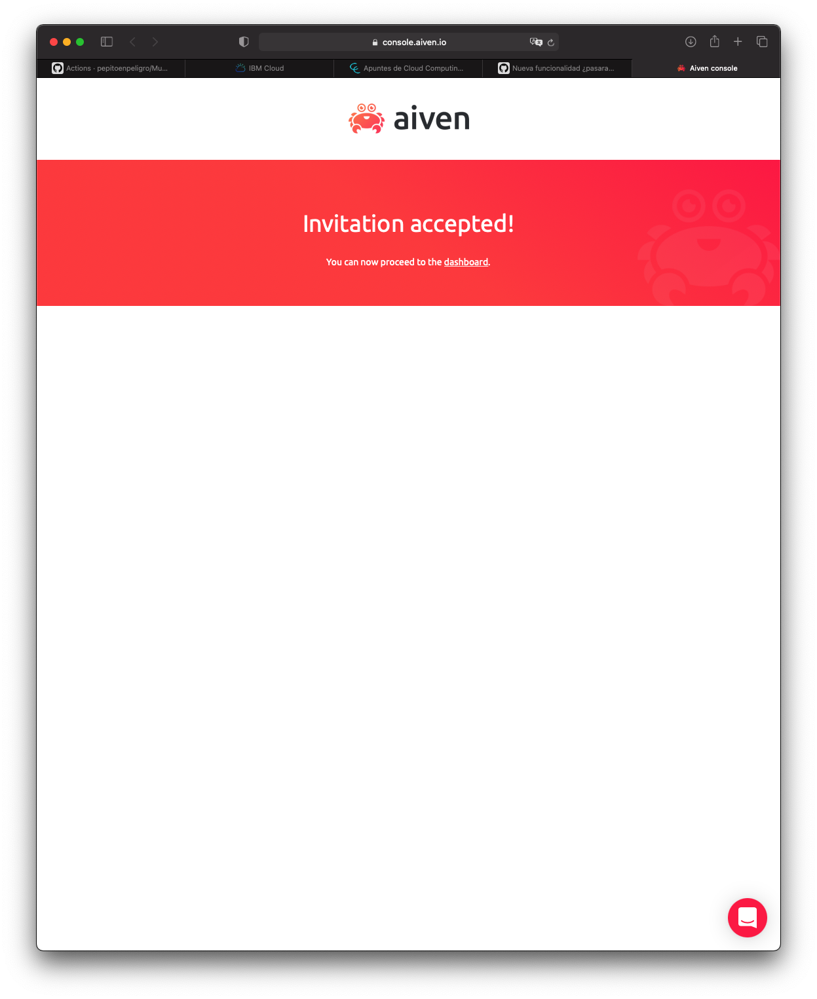

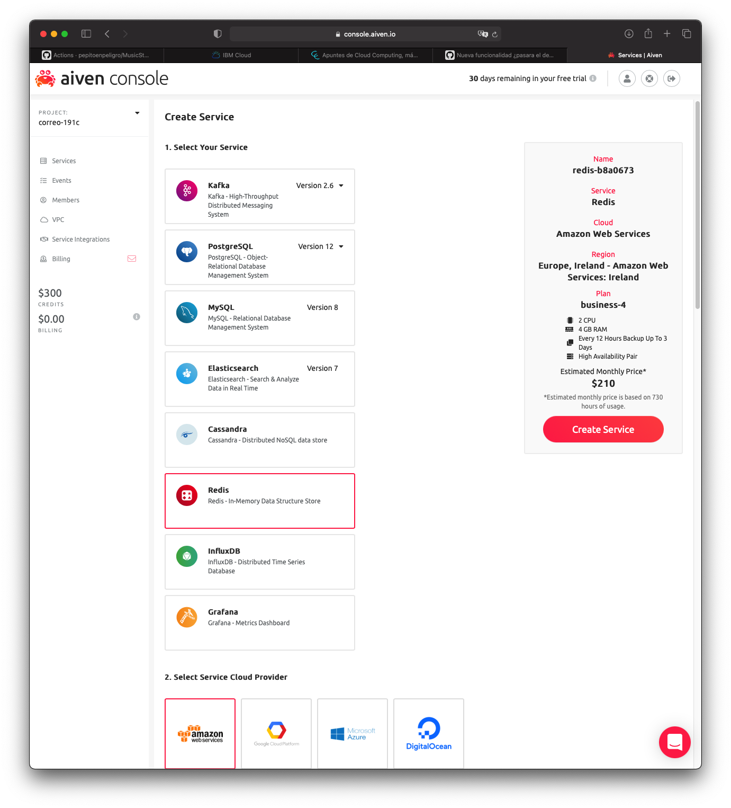

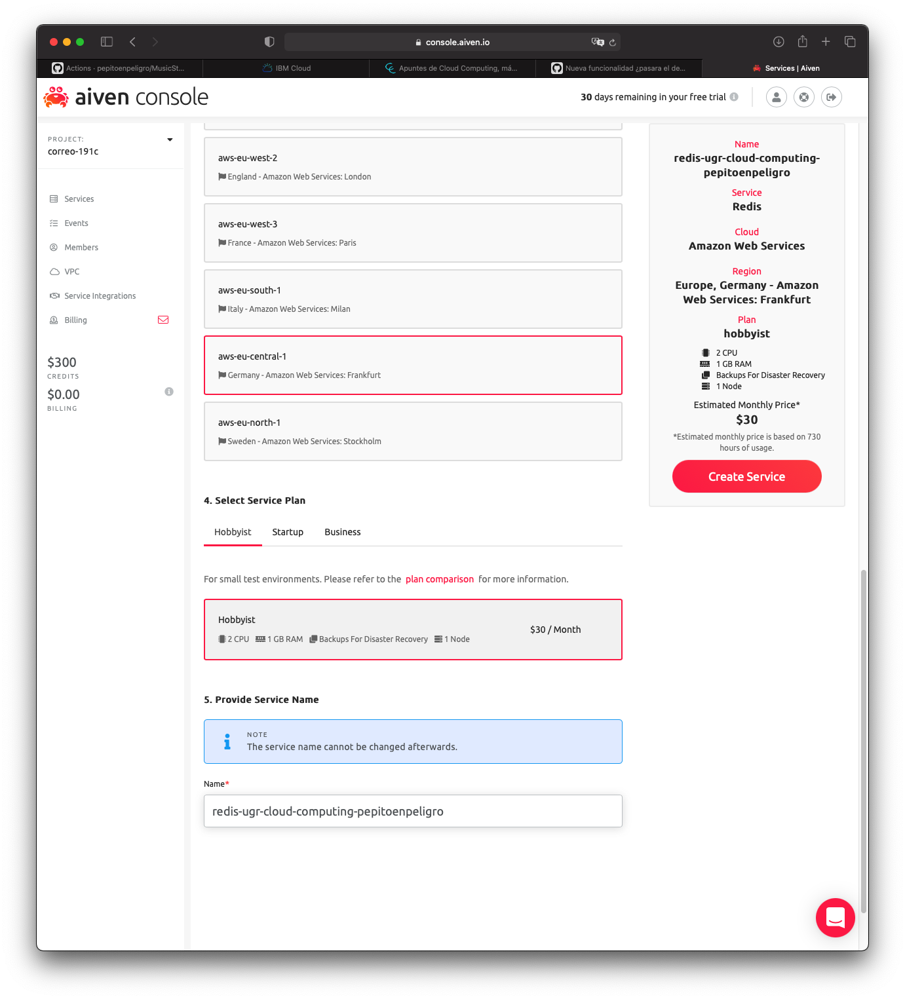

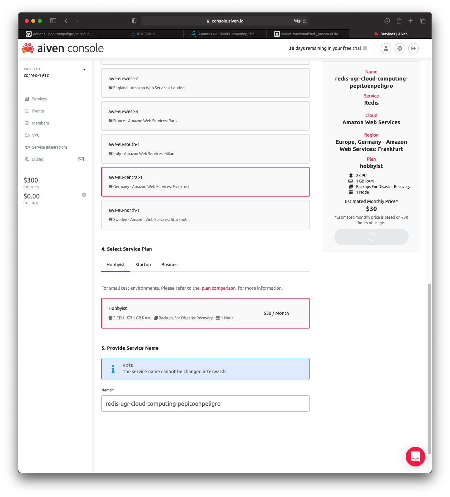

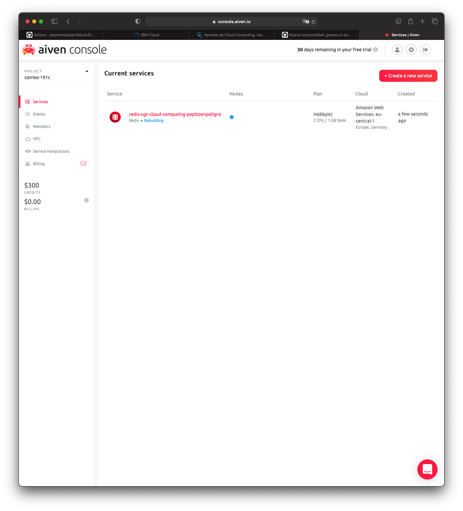

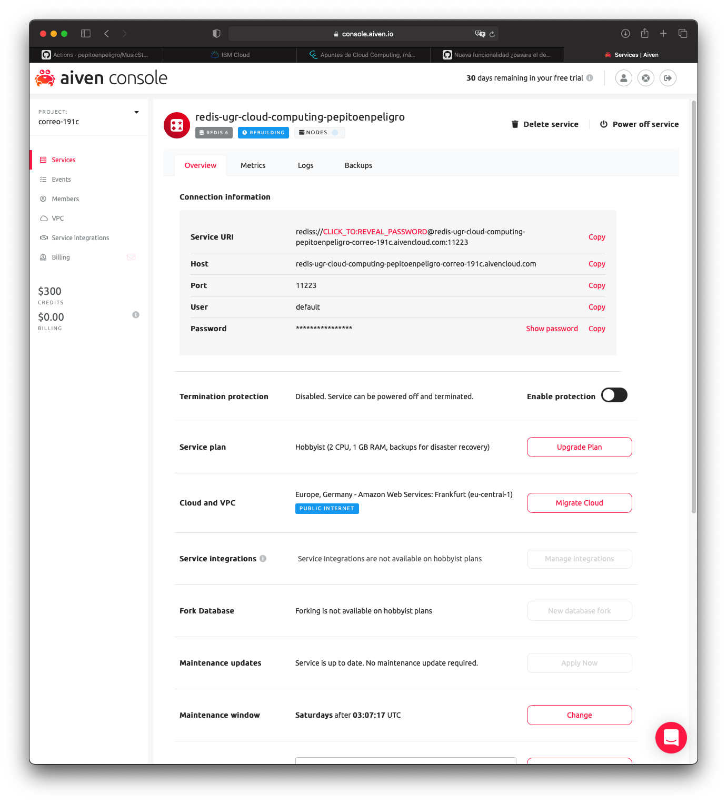


Instalamos redis:

```bash
brew install redis
```

Nos conectamos a traves de la herramienta cli de redis

```bash
redis-cli -u rediss://default:<password>@redis-ugr-cloud-computing-pepitoenpeligro-correo-191c.aivencloud.com:11223
```


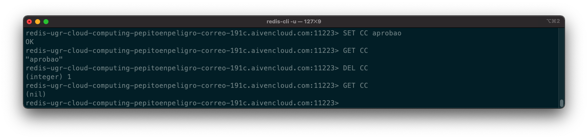

Creamos un pequeño programa que prueba las operaciones CRUD sobre la base de datos remota

```javascript

const redis = require("redis");

console.log("Hola");
const client = redis.createClient({
    url: 'rediss://default:<passwd>@redis-ugr-cloud-computing-pepitoenpeligro-correo-191c.aivencloud.com:11223'
});

client.set("username", "pepitoenpeligro");
client.get("username", redis.print);
client.del("username");
client.get("username", redis.print);


```


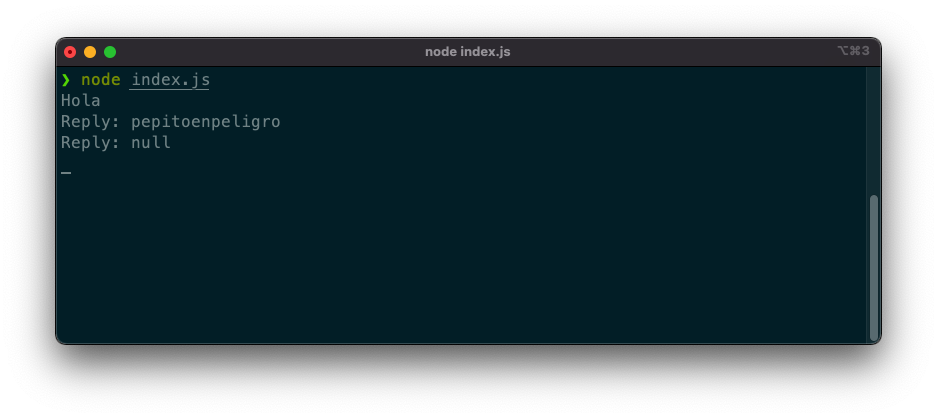


## Ejercicio 8

`Realizar un pequeño programa, en el lenguaje elegido y sobre la base de datos tradicional elegida que realice el ciclo básico de una base de datos. Puede ser la aplicación de calificación de empresas realizarda anteriormente`

Hemos desplegado dos servicios. Uno con la interfaz (testalv) y otro con el backend (testalvserver). Esta aplicación consiste en una plataforma para entrenar exámanes de tipo test para la certificación PER (patron de embarcaciones de recreo) de la Junta de Andalucía. 

El código fuente es opensource y se puede ver en (testalvserver)[https://github.com/pepitoenpeligro/testalvserver]

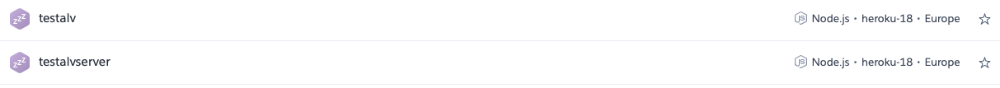


Vamos a poner un extracto de código significativo respecto a la obtencion de la base de datos de las unidades (lo que compone cada uno de los exámenes):


```javascript
exports.getunitslist = (req, res) => {
    console.log("Server -> ", "Pidiendo lista de unidades disponible");
    let listUnidadesName = [];
    let promesaBuscarUnidades = Promise.all([Unit.find({}).exec()])
    promesaBuscarUnidades.then((response) => {
        let cont = 0;
        for(const s of response[0]){
            listUnidadesName.push(s['name']);
            cont++;
            if(response[0].length == cont){
                return res.status(200).json({
                    listUnidadesName
                })
            }
        }
    }).catch((error) => {
        console.log("Error al buscar las unidades");
    })
}
```

Esto se responde en la ruta:

```javascript
router.post('/units/list', getunitslist);
```

Y se permite acceder mediante la interfaz con:

```javascript
<StudentRoute path="/student" exact component={Student}></StudentRoute>
```


Se recogen los datos en el cliente como:

```javascript
React.useEffect(() => {
         
         axios({
             method: 'POST',
             url: `${process.env.REACT_APP_API}/units/list`,
             headers:{
                'Content-Type': 'application/json',
                'Accept':'application/json'
            }}).then(function(response ){
                console.log("[/units/list] Received:", response.data.listUnidadesName);
                setValues(values => ({...values, nombreUnidades: response.data.listUnidadesName}))
            })
        }, [])
```


A continuación vamos a mostrar unas capturas para demostrar que funciona:


