# Tema 8. Desplegando aplicaciones en la nube: Uso de PaaS y DBaaS

## Ejercicio 1

`Darse de alta en algún servicio PaaS tal como Heroku o BlueMix o usar alguno de los PaaS de otros servicios cloud en los que ya se esté dado de alta`

Creamos una cuenta en IBM Cloud
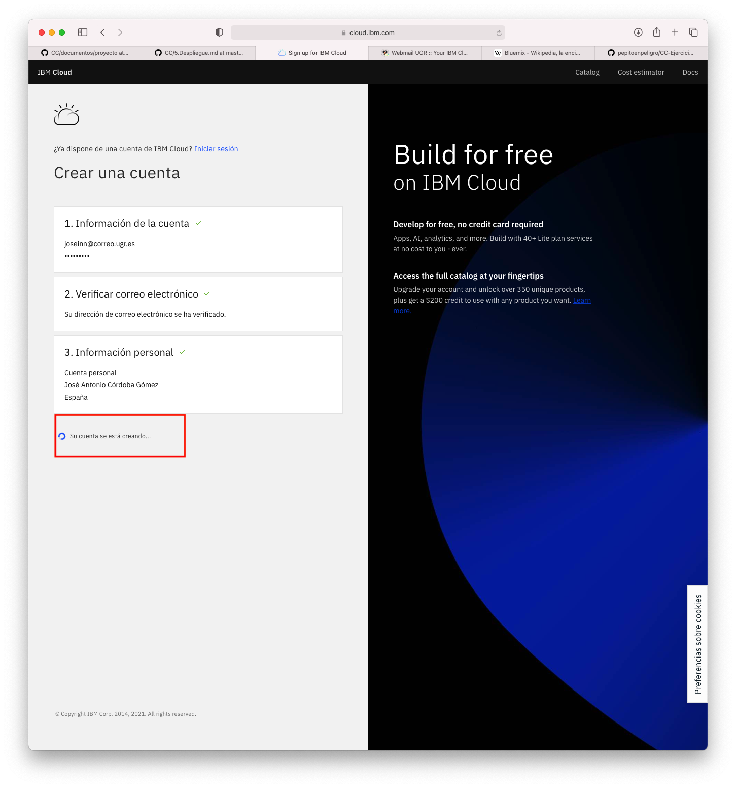

Aceptamos los términos de condiciones del servicio y las cláusulas de privacidad de la cuenta de IBM Cloud

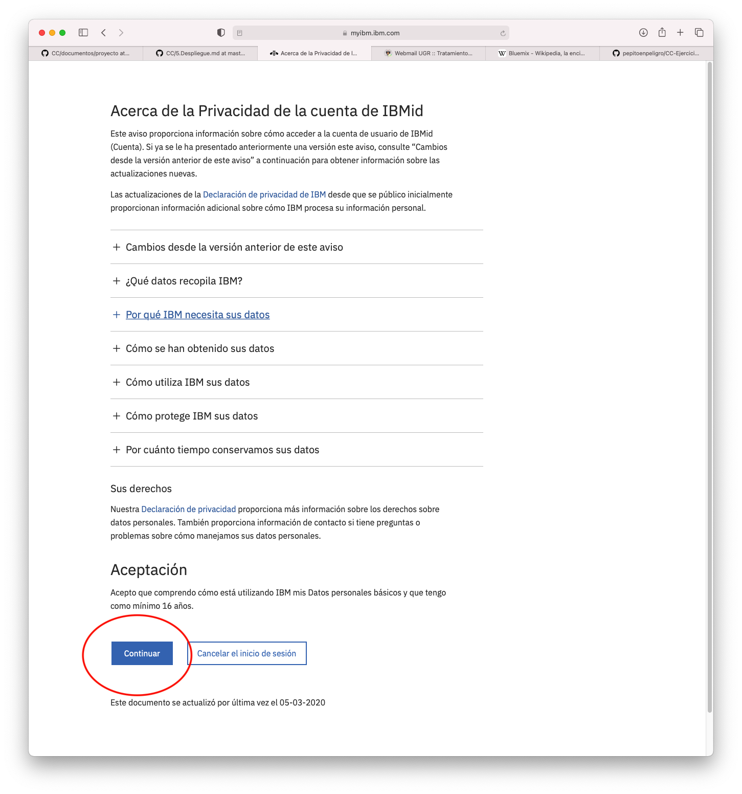

IBM cloud nos da la bienvenida y nos muestra un dashboard en el que podemos observar el estado inicial de la cuenta y las acciones posibles. Vamos a tratar de crear un recurso BlueMix, o como lo llaman ahora, CloudFoundry.

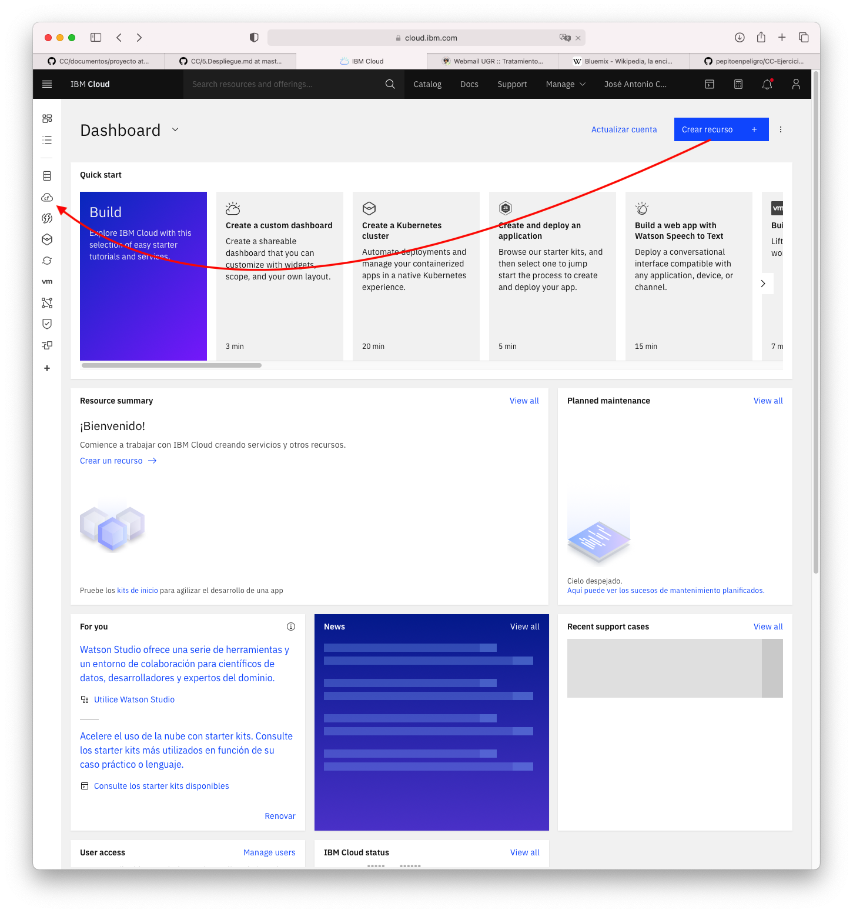

Seleccionamos la opción de crear un nuevo recursos. Dentro nos da la opción de elegir el entorno de ejecución que vamos a usar.

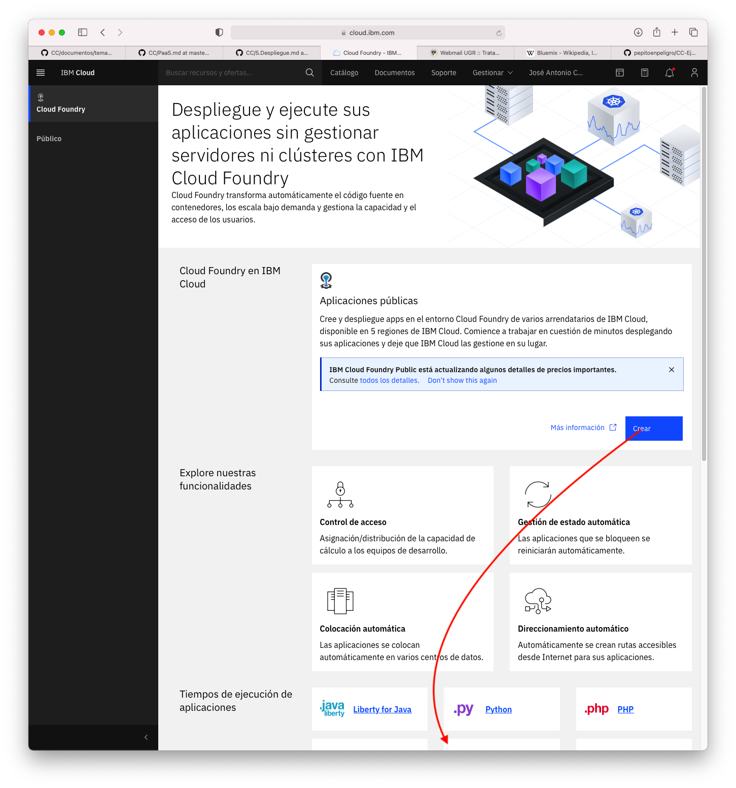

Como tengo claro que voy a usar mi aplicación de gestión de tienda musical escrita en nodejs, eligo el entorno de nodejs.

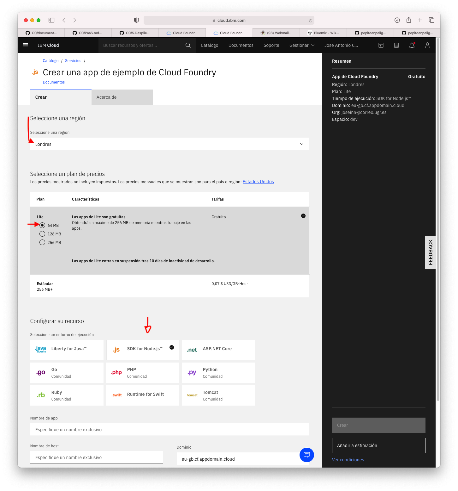

A continuación elegimos el dominio para exponer nuestro desarrollo, nos da a elegir un dominio dentro de la antigua marca (bluemix), pero nosotros vamos a seguir usando la actual, la de cloudfoundry.

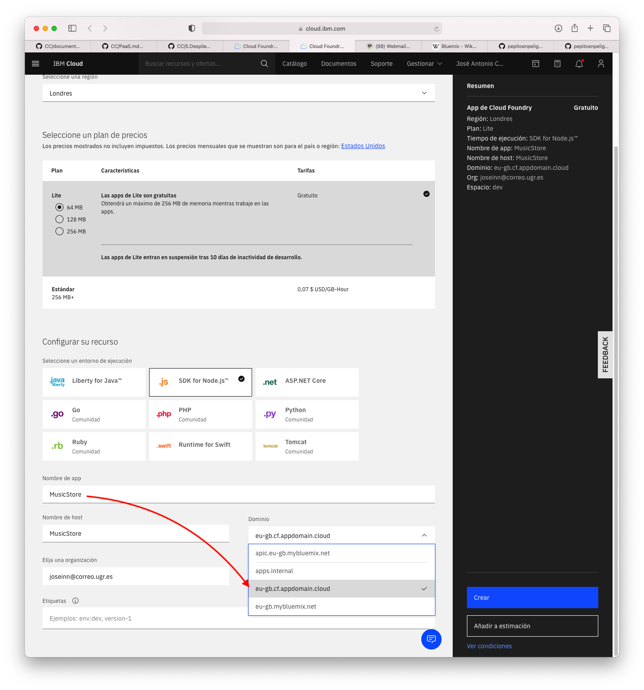

Creamos el recurso finalmente 
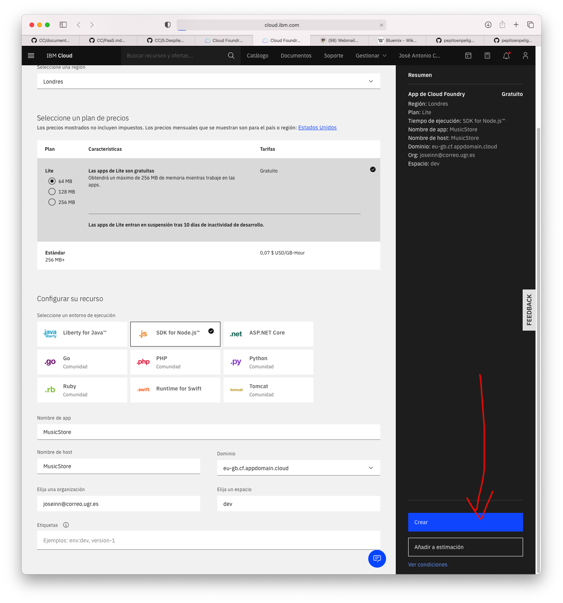

Esperamos a que complete la creación y el despliegue del recurso.
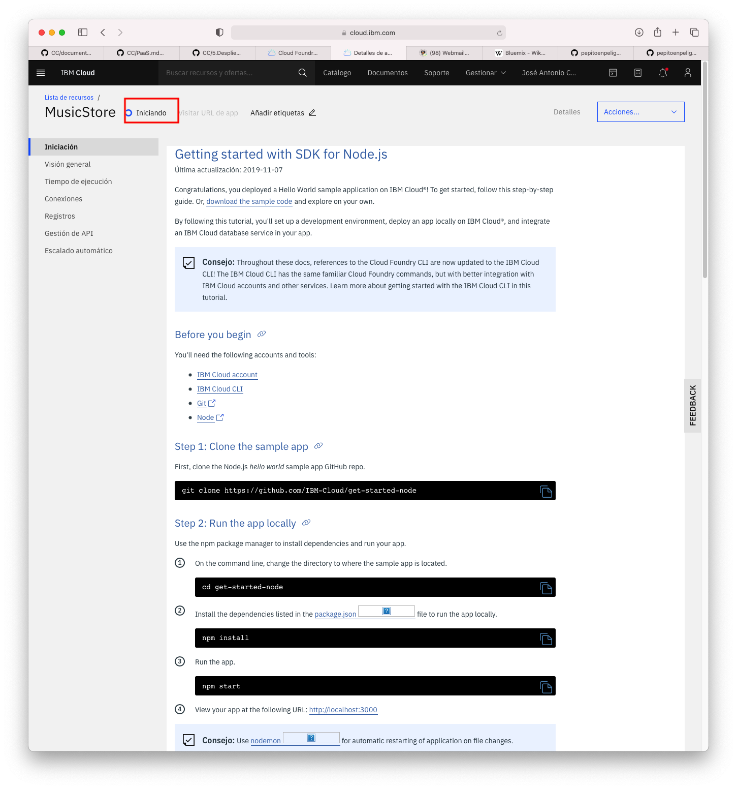
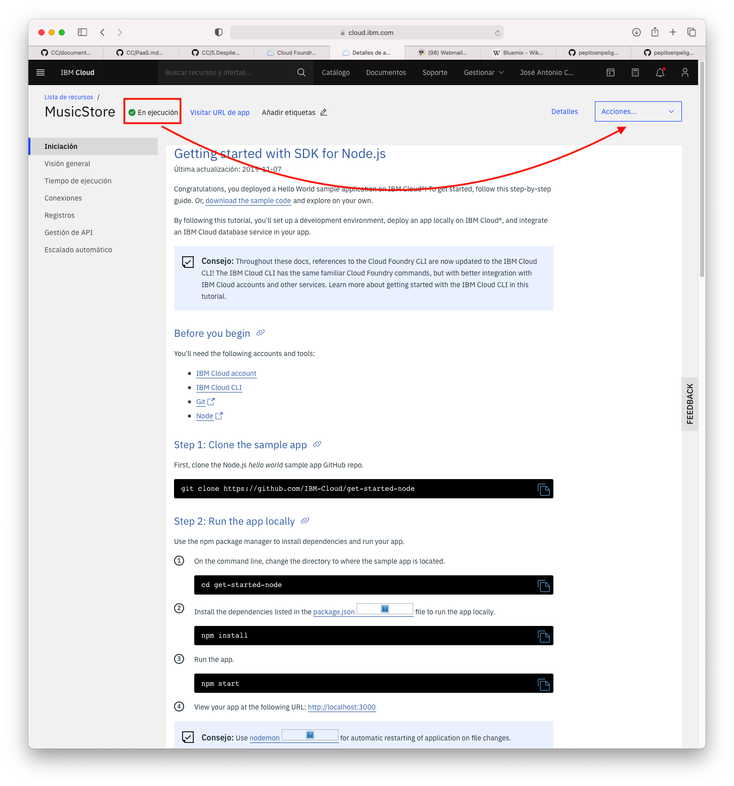

Una vez finalizada la creación del recurso vamos a tratar de acceder a la aplicación de prueba que nos integra IBM Cloud Foundry por defecto.

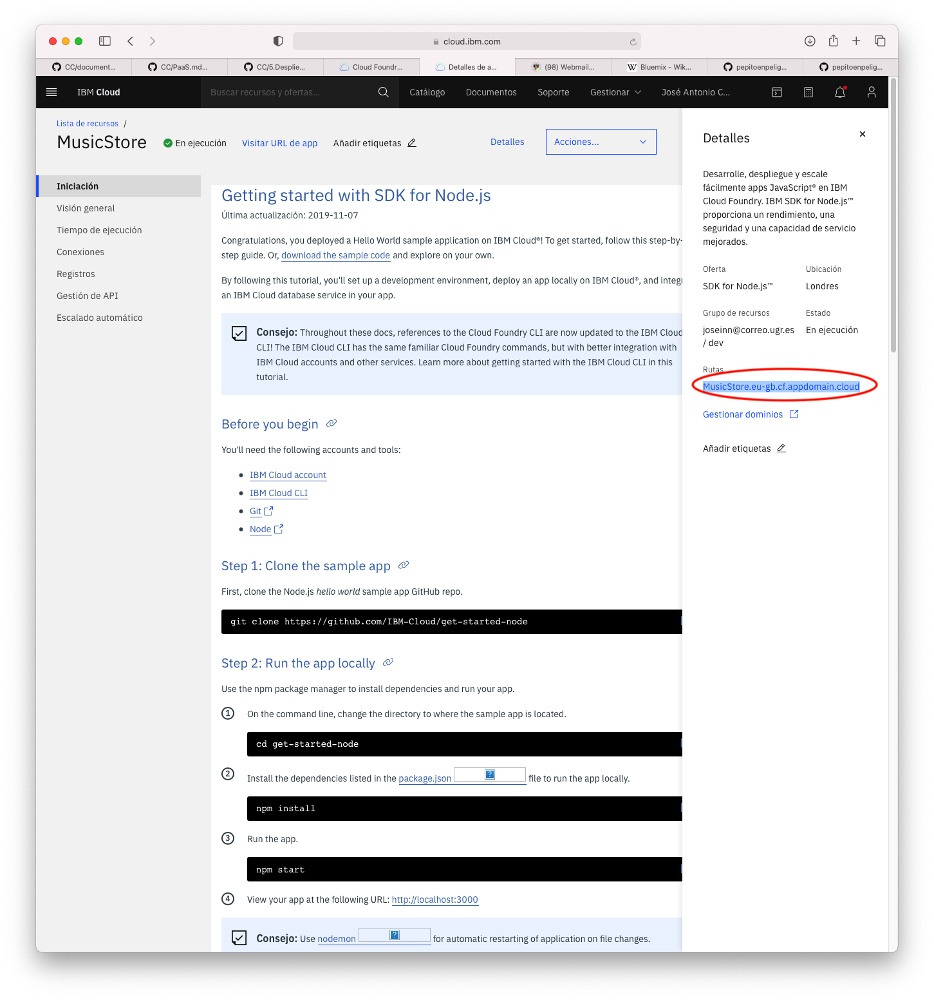

Finalmente podemos acceder a la aplicación de demo de forma satisfactoria.

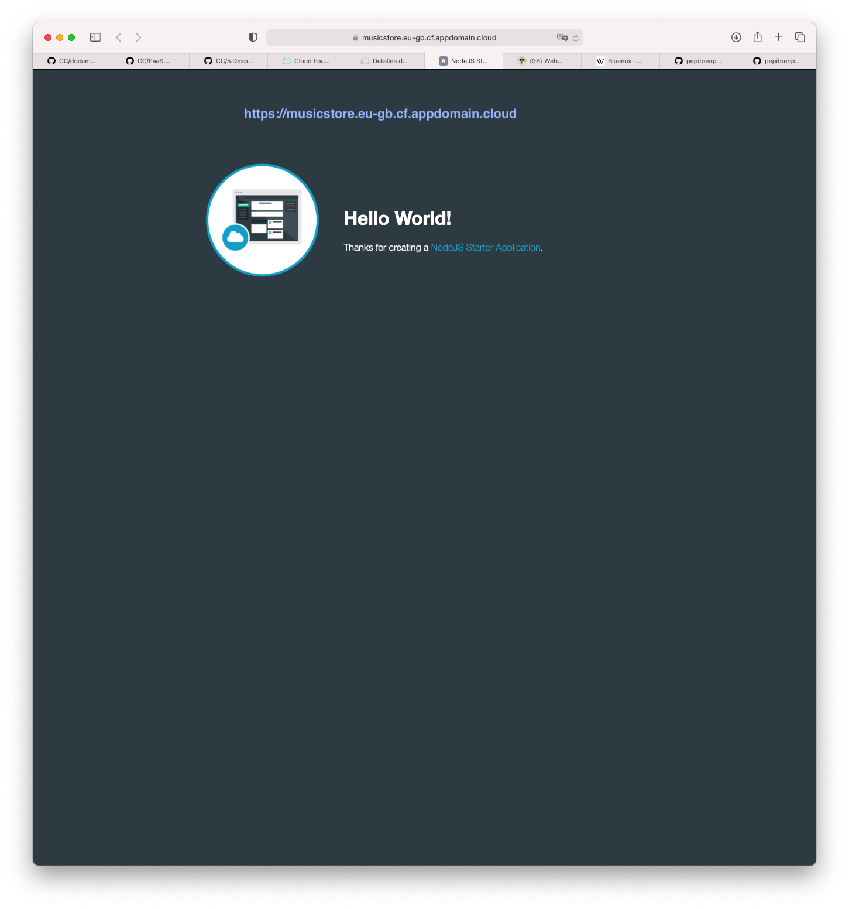

## Ejercicio 2

`Crear una aplicación en Heroku o en algún otro PaaS en el que se haya dado uno de alta. Realizar un despliegue de prueba usando alguno de los eejmplos incluidos con el PaaS`

La aplicación de demo que se ha dado ha sido desplegada en el ejercicio 1, por favor, lee el ejercicio 1 antes, que lo detallo paso por paso.

## Ejercicio 3

`Instalar y echar a andar tu primera aplicación en Heroku`

## Ejercicio 4

`Usar como base la aplicación de ejemplo de heroku y combinarla con la apicación en node que se ha creado anteriormente. Probarla de forma local con foreman. Al fina de cada modificación, los test tendrán que funcionar correctamente; cuando se pasen los tes, se puede volver a desplegar en heroku`

## Ejercicio 5

`Haz alguna modificación a tu aplicación en node.js para Heroku, sin olvidar añadir los test para la nueva funcionalidad, y configura el despliegue automático a Heroku usando algún servicio de los mencionados en StackOverflow`

## Ejercicio 6

`Crear una aplicación mínima y usar un buildpack no estándar para desplegarla en Heroku. Esto será imprescindible si se usan lenguajes como Rust, por ejemplo`

## Ejercicio 7

1. `Darse de alta en un servicio Redis en la nube y realizar sobre él las operaciones básicas desde el panel de control`
2. `Instalar un cliente de línea de órdenes de Redis o una biblioteca cliente REST y realizar desde él las operaciones básicas de creación y lectura de información`
3. `Ejecutar ejemplos de cualquier lenguaje de programación sobre la instalación realizada`

## Ejercicio 8

`Realizar un pequeño programa, en el lenguaje elegido y sobre la base de datos tradicional elegida que realice el ciclo básico de una base de datos. Puede ser la aplicación de calificación de empresas realizarda anteriormente`
